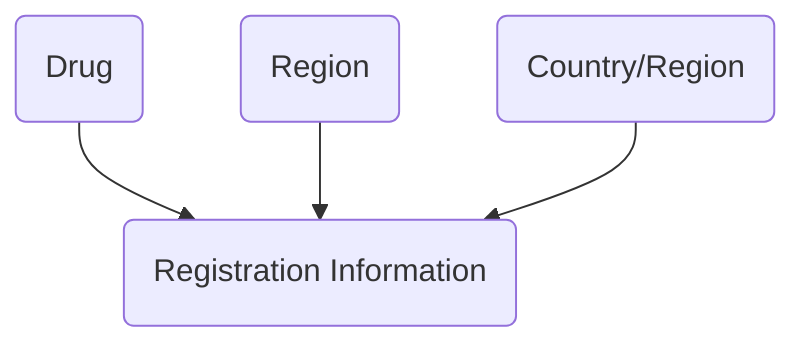

# Modules
__*Drug相关的功能主要用于记录试验药品等信息，其功能分布如下：*__
### 1 Entity
##### 1.1 Drug
Drug用于记录申办方研究的药品信息，可供所有实验使用。
### 2 Library
Library是一个针对申办方的公用模板模块，其中的数据可以供所有试验使用。与Drug相关的模块主要是Reference Data，其中需要使用的数据有Region和Country。
##### 2.1 Reference Data-Region
Region中是地区信息，用户可以自定义。
##### 2.2 Reference Data-Country/Region
Country/Region中是国家/地区信息，用户可以自定义。
### 3 Study Management
##### 3.1 Study Setup and Information Improvement - Registration Information
Registration Information记录了Study中的药品注册信息详情。

# Data Flow

