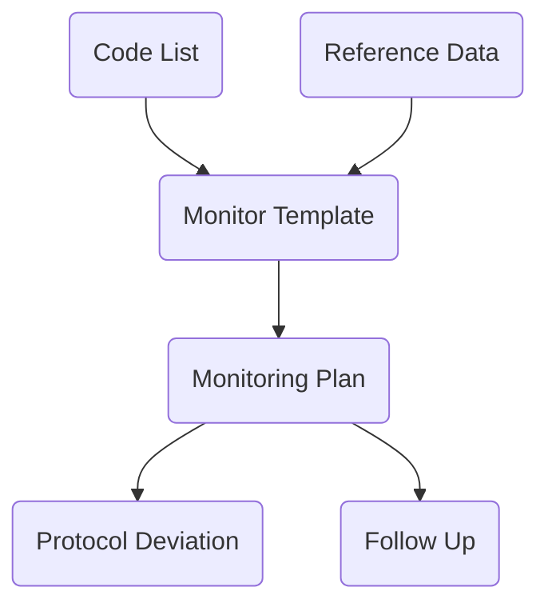

# Modules
__*Monitroing相关的功能主要用于监查访视，其功能分布如下：*__
### 1 Library
Library是一个针对申办方的公用模板模块，其中的数据可以供所有试验使用。与Monitoring相关的模块主要是Code List，Reference Data和Monitor Template。
##### 1.1 Code List
Code List可用于表单设计中，在Radio，ListBox，CheckBox，Code List Group上使用。
##### 1.2 Reference Data
用于设计Monitoring Visit Tyep。
##### 1.3 Monitor Template
Monitor Template用于监查访视的表单模板设计。
### 2 Study Management
##### 2.1 Study Quality Control - Monitoring Plan
Monitoring Plan包括监查访视的计划及其实施和跟踪。详细的节点包括：
Monitoring Plan（监查访视的计划）
Plan Confirm（监查访视计划的确认）
Confirm Letter（发送监查访视计划确认信函）
Actual Date（监查访视的实际实施时间）
Trip Report（监查访视详情-表单数据录入）
Protocol Deviation（监查访视中发现的方案偏离记录）
Follow Up（监查访视中发现的问题）
Follow Up Letter（监查访视中发现的问题跟踪信函）
##### 2.2 Study Quality Control - Follow Up
Follow Up中包括所有Monitoring Plan中发现的问题。可以查看问题详情以及关闭问题。

# Data Flow

