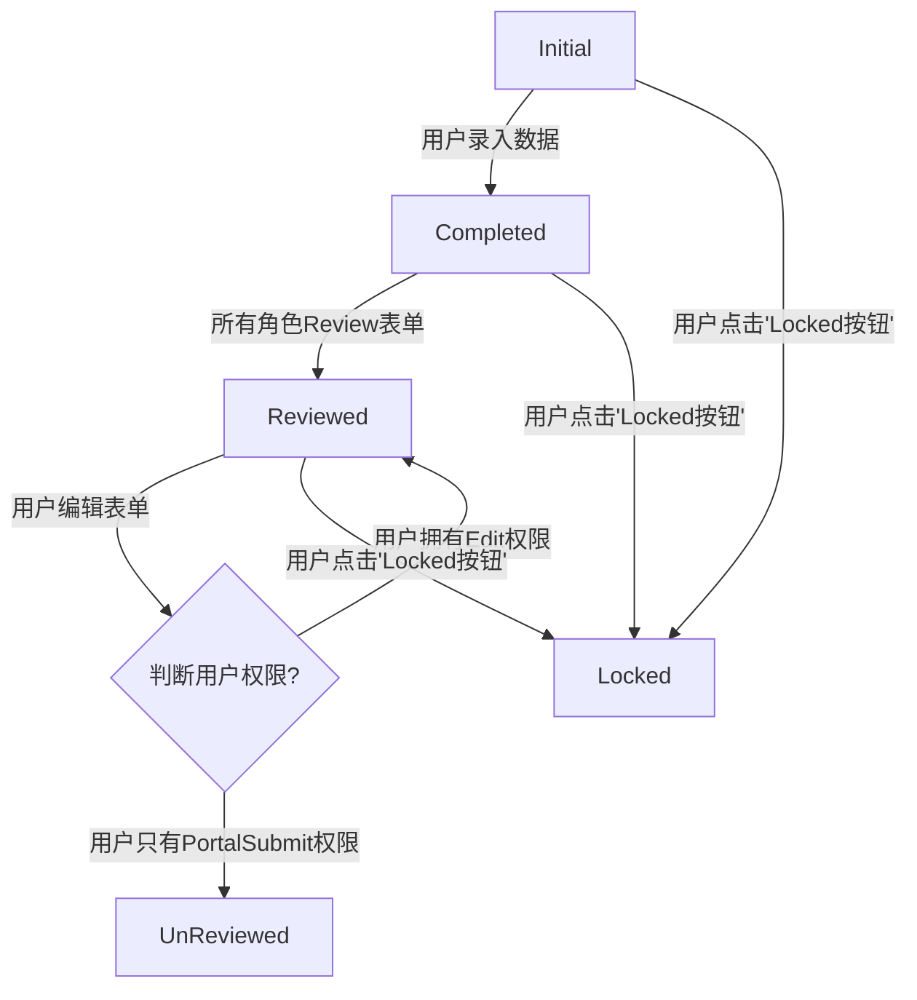

# 状态变化

# Initial
定义: 表单刚初始化，用户对表单未做任何操作

# Completed
定义: 用户 submit 过数据

![[code_list_name.png]]

# Reviewed
定义: 表示表单Review完成
变化条件: 
 * [[PD Setting#3 3 Set Condition|所有需要Review的角色已对表单Reviewed]]
 * 在已Locked的状态表单，做Unlocked操作
 
 
 # UnReviewed
 定义: 该表单曾经被Reviewed通过，但是因某种原因取消了Reviewed
 变化条件:
 * 表单已Reviewed ,被任一角色取消了Review
 * 数据录人修改了表单数据 [[PD Setting#3 3 Set Condition| 审核人修改数据不会修改状态]]

# Locked
定义: 表单已被锁定，不可修改

# Inactive
定义: 该表单失效
变化条件: 表单状态为非Locked
 # Active
 定义: 表单有效
 变化条件:
 * 默认刚初始化的表单为Active
 * Inactive状态下点击"Active按钮"