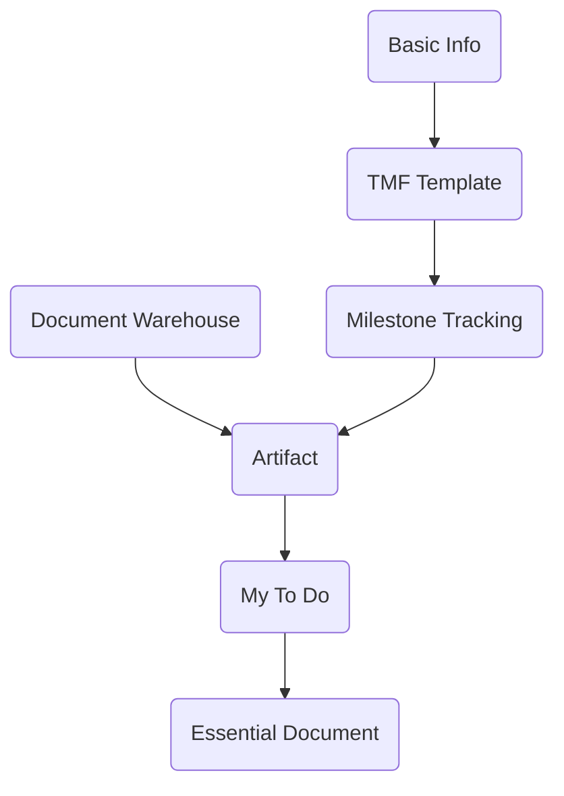

# Modules  
__*TMF(Trial Master File)的功能主要集中在CTMS系统的Study Management模块，其功能分布如下：*__
### 1.Study Setup and Innformation Improvement
##### 1.1Basic Information  
在填写试验基本信息时选择TMF版本，保存试验基本信息时，TMF Template中会初始化Milestone和Artifact Category数据。
##### 1.2TMF Template  
TMF Tempalte中展示Milestone和Artifact的Category数据，初始化数据为System数据，不允许修改。支持新增和编辑Custom Category数据，但是已经被实例化的Category数据不允许编辑。
### 2.Study Progress Tracking
##### 2.1Milestone Tracking
Milestone Tracking中，可以根据TMF Template中Milestone Category的数据，新增(实例化)Milestone，然后在Milestone中设置(实例化)Artifact。
实例化Milestone和Artifact时，可以分别为Study Level或者Site Level实例化数据。
##### 2.2Artifact
Artifact中展示实例化后的Artifact数据，Artifact被Start Up以后，会发送到相关人员的My To Do中，可以在Artifact或者My To Do中上传Expected File来完成Artifact。
目前文件支持本地上传和系统上传(Document Warehouse中的文件)。
上传文件可以选择Draft或者Final版，Draft版的文件会进入My To Do中进行审核，Final版的文件无需审核，主文件被审核通过以后，从属文件自动归档到Essential Document。
### 3.My To Do
My To Do中可以上传Expected File文件；还可对Artifact中上传的文件进行审核，主要流程包括Approve和Sign。
My To Do中的任务根据任务截止时间来划分，分为Due Today、Overdue和Schedule。
My Document中存放当前用户上传的文件，用户可根据文件的审核状态对任务进行催办。
### 4.Document Management
##### 4.1Document Warehouse
Document Warehouse主要用于文件暂存和预审核。
Document Warehouse中审核通过的文件，可供用户在Artifact(My To Do)中上传文件时使用。
##### 4.2Essential Document
Essential Document中存放的是已归档的文件，但必须要主文件归档以后，已经签署通过的从属文件才会归档。

# Data Flow
