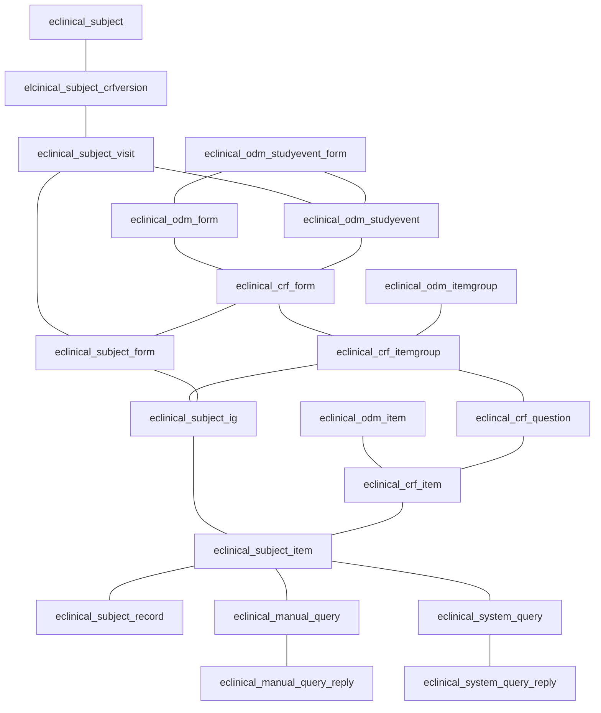
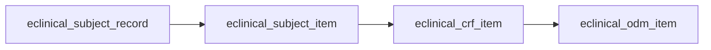

```mermaid
graph TB
eclinical_subject[eclinical_subject] ---
eclinical_subject_crfversion[elcinical_subject_crfversion]---eclinical_subject_visit[eclinical_subject_visit] --- eclinical_odm_studyevent[eclinical_odm_studyevent];
eclinical_subject_visit[eclinical_subject_visit] --- eclinical_subject_form[eclinical_subject_form]
eclinical_odm_form[eclinical_odm_form] --- eclinical_crf_form[eclinical_crf_form]--- eclinical_crf_itemgroup[eclinical_crf_itemgroup] --- eclinical_subject_ig[eclinical_subject_ig] ---eclinical_subject_item[eclinical_subject_item]---eclinical_subject_record[eclinical_subject_record];
eclinical_odm_studyevent_form[eclinical_odm_studyevent_form] ---
eclinical_odm_form[eclinical_odm_form]; eclinical_odm_studyevent_form[eclinical_odm_studyevent_form] --- eclinical_odm_studyevent[eclinical_odm_studyevent];
eclinical_odm_studyevent[eclinical_odm_studyevent]---eclinical_crf_form[eclinical_crf_form]---eclinical_subject_form---eclinical_subject_ig[eclinical_subject_ig];
eclinical_subject_item[eclinical_subject_item]---eclinical_manual_query[eclinical_manual_query] --- eclinical_manual_query_reply[eclinical_manual_query_reply];
eclinical_subject_item[eclinical_subject_item]---eclinical_system_query[eclinical_system_query] --- eclinical_system_query_reply[eclinical_system_query_reply];
eclinical_odm_item[eclinical_odm_item]---eclinical_crf_item[eclinical_crf_item]---eclinical_subject_item[eclinical_subject_item];
eclinical_odm_itemgroup[eclinical_odm_itemgroup] --- eclinical_crf_itemgroup[eclinical_crf_itemgroup];
eclinical_crf_itemgroup[eclinical_crf_itemgroup] --- eclincal_crf_question[eclincal_crf_question] --- eclinical_crf_item[eclinical_crf_item];

```

# DataEntry
## 路径1

```mermaid
graph LR
eclinical_subject_record[eclinical_subject_record] --> eclinical_subject_item[eclinical_subject_item] --> eclinical_crf_item[eclinical_crf_item] --> eclinical_odm_item[eclinical_odm_item]
```