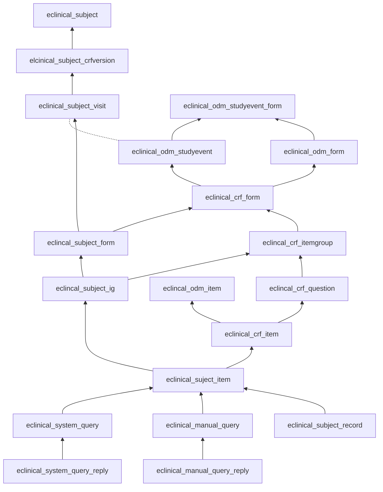
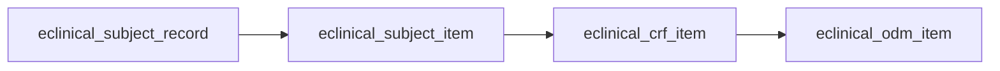
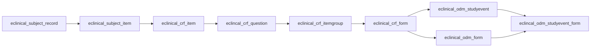
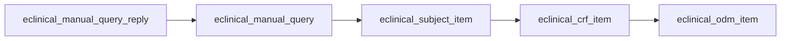
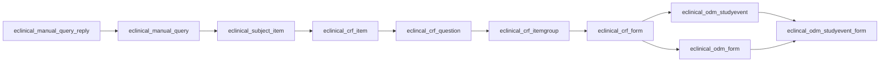
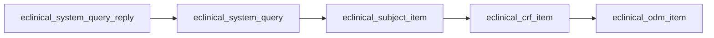
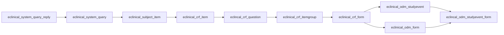

```mermaid
graph LR
eclinical_system_query_reply[eclinical_system_query_reply] -->
eclinical_system_query[eclinical_system_query] -->
eclinical_subject_item[eclinical_subject_item] --> eclinical_subject_ig[eclinical_subject_ig] --> eclinical_subject_form[eclinical_subject_form] -->eclinical_subject_visit[eclinical_subject_visit]-->
eclinical_subject_crfversion[eclinical_subject_crfversion]-->eclinical_subject[eclinical_subject]
```

eclinical_odm_studyevent 无法直接关联到eclinical_subject_visit， 因为无法 crf_version_id 无法直接关联到eclinical_subject_visit

# DataEntry
## 路径1

## 路径2

## 路径3

## 路径4

# Manual Query
## 路径1

## 路径2

## 路径3

## 路径4

```mermaid
graph LR
eclinical_manual_query_reply[eclinical_manual_query_reply] -->
eclinical_manual_query[eclinical_manual_query] --> eclinical_subject_item[eclinical_subject_item] --> eclinical_subject_ig[eclinical_subject_ig] --> eclinical_subject_form[eclinical_subject_form] -->eclinical_subject_visit[eclinical_subject_visit]-->
eclinical_subject_crfversion[eclinical_subject_crfversion]-->eclinical_subject[eclinical_subject]
```

# System Query
## 路径1

## 路径2

## 路径3

## 路径4

