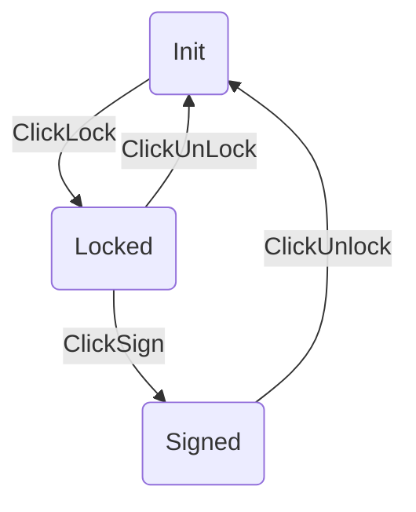

# Add
![[Pasted image 20210618204307.png]]
![[Pasted image 20210618204325.png]]

Buttons

|Name| Desc|
| -- | -- |
|Save | save the Adverse Event | 
|Submit | save and send email |
|Cancel | return to case Page|

# Remove
![[Pasted image 20210618204537.png]]
# Restore
![[Pasted image 20210618204628.png]]
# Attachment
Upload the Attachment
![[Pasted image 20210618203609.png]]
![[Pasted image 20210618203647.png]]
it can display in eTMF
![[Pasted image 20210618203957.png]]

# Export CIOMS
# Export FDA3500A

# Download File
Pre Condition : AE Version have been signed.
![[Pasted image 20210617155125.png]]

# CRF 
Not currently availiable, Because "Sync EDC Data" is not availiable

# Back
Return to Case Page

# AE Version
## Edit Version
![[Pasted image 20210618204743.png]]

## Remove Version
![[Pasted image 20210618204934.png]]
## Resore
![[Pasted image 20210618204953.png]]

## View
ReadOnly, View the AE Version 

## Download File
export PDF
![[Pasted image 20210618204847.png]]

## Version Type
- Initial
- Follow-up
- Final

## Change Status

## History
see the donwload history of PDF
![[Pasted image 20210618205235.png]]
