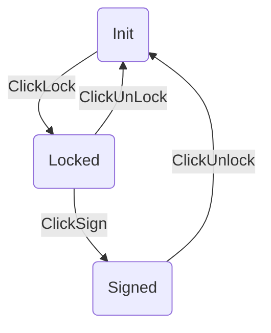

# Function
Edit the Case Version
![[Pasted image 20210618200715.png]]

![[Pasted image 20210618200742.png]]
it have three version
- Init
- Follow-up
- Final

it have three status
- Inital
- Locked
- Signed

Stats Change

![[Pasted image 20210618201738.png]]

Buttons

|  Name | Description |
| -- | -- |
| Save | Save the Case Verion |
| Submit | Save and send the email |
| Cancer| Return to the Case Page |