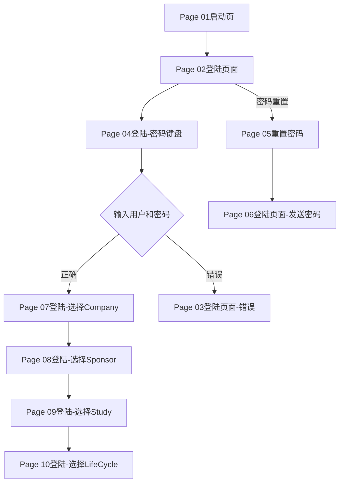

```mermaid
graph TB
A[Page 01启动页]-->B[Page 02登陆页面]-->C1[Page 04登陆-密码键盘]-->C{输入用户和密码}
C--正确-->D[Page 07登陆-选择Company]-->E[Page 08登陆-选择Sponsor]-->F[Page 09登陆-选择Study]-->G[Page 10登陆-选择LifeCycle]
C--错误-->K[Page 03登陆页面-错误]
B--密码重置-->L[Page 05重置密码]-->M[Page 06登陆页面-发送密码]
```

Page 路径：EDCApp4.0 / Login
# 备注
- Page 02,03,04,05,06 其中03有查看密码的Icon, 其它没有, 需要看开发做出来的到底有没有，然后确认

