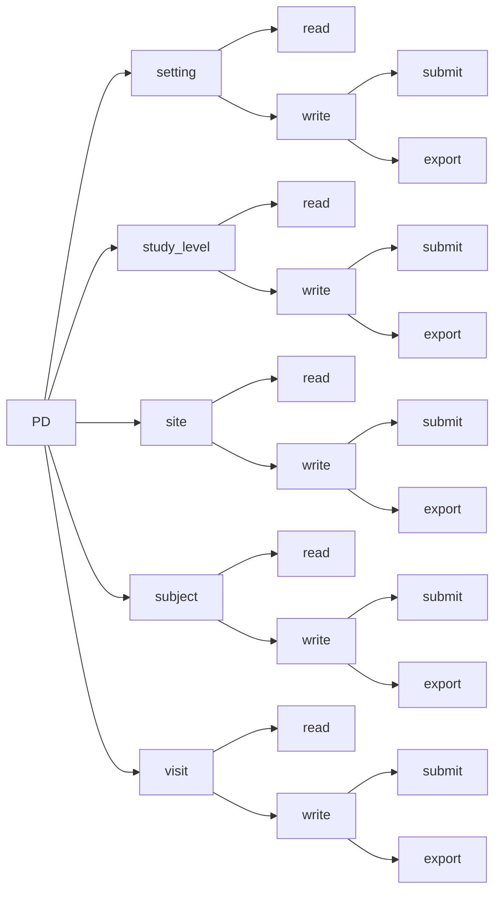

# 权限图

```mermaid
graph LR
PD-->setting
setting-->sr[read]
setting-->sw[write]
sw-->swx[submit]
sw-->swd[export]

PD-->study_level
study_level-->slr[read]
study_level-->sl[write]
sl-->slx[submit]
sl-->sle[export]

PD-->site
site-->siter[read]
site-->s[write]
s[write]-->sx[submit]
s[write]-->se[export]

PD-->subject
subject-->subr[read]
subject-->sub[write]
sub[write]-->subs[submit]
sub[write]-->sube[export]

PD-->visit
visit-->vr[read]
visit-->v[write]
v-->vs[submit]
v-->ve[export]
```

# 权限说明
## submit
可在PD表单中录入和修改数据
## export
导出