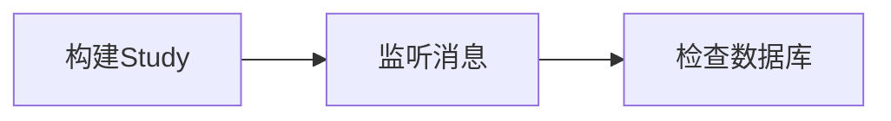

# 流程

# 构建Study
消息同步涉及ctms,edc,iwrs,所以测试的时候需创建一个随机试验

# 监听消息
1.打开[[测试小助手]]选择你期望监听的环境
2.页面展示你要监听的消息服务器
![[Pasted image 20211102185226.png]]
3.启动监听服务器
![[Pasted image 20211102185300.png]]
4.页面展示启动情况
![[Pasted image 20211102185428.png]]
5.修改监听参数(可选项)
基本上参数是根据开发提供内置的，但有些时候消息服务器只有一个.
前置条件：没有启动监听
![[Pasted image 20211103095920.png]]
修改参数的 "BrokerURL", "DestName" 需配对
![[Pasted image 20211103100145.png]]
6.CTMS 更新Site
![[Pasted image 20211103101042.png]]
当有下图展示，则说明消息服务器发送成功
![[Pasted image 20211103101115.png]]
7.检查数据库
点击“查看数据库按钮”
![[Pasted image 20211103101352.png]]
出现如下界面
![[Pasted image 20211103101418.png]]
"环境"，"SponsorID", "StudyID" 是根据消息带出的，也可以自己编辑
点击 "查询数据库"
![[Pasted image 20211103101736.png]]
显示对应的系统关联数据库，目前展示的有,portal, edc, iwrs
![[Pasted image 20211103101938.png]]

