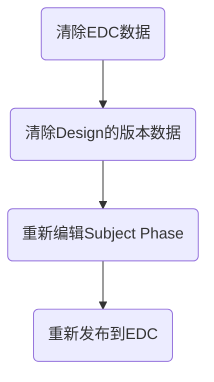

# 处理流程


## 1. 清除EDC数据
数据库中执行 [[sk_dev_0325_truncate all except study site basic info | EDC数据库清理脚本]] ==执行前先请胡显邦确认脚本==
## 2. 清除Design的版本发布记录
```sql
truncate eclinical_crf_version_publish;
```
==执行前先请肖尧确认脚本==
## 3. 重新编辑Subject Phase
## 4. 发布新的Subject Phase 到 EDC