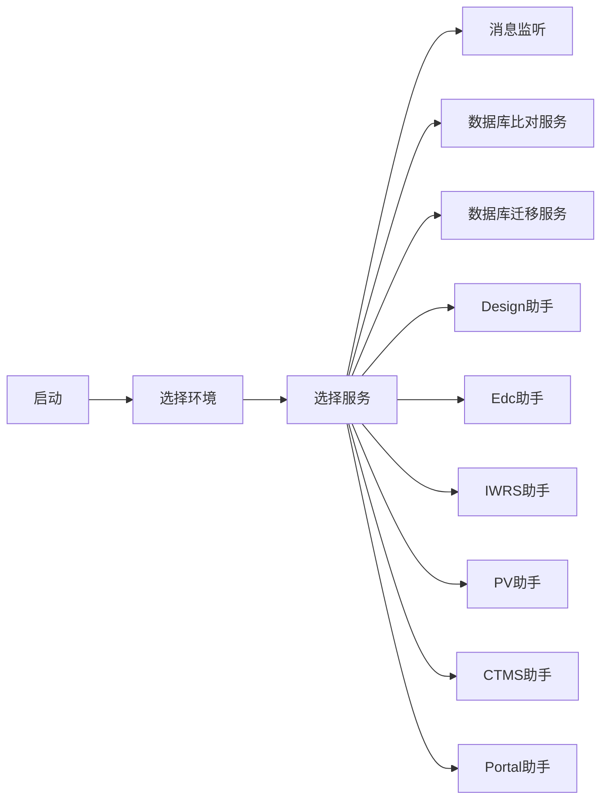

# 环境准备
安装 Java环境，至少JDK8 以上

[下载地址](http://200.200.101.73/eClinical4.0_testing_group/eClinical4.0_testing/tree/master/%E5%86%85%E9%83%A8%E6%B5%8B%E8%AF%95%E5%B7%A5%E5%85%B7)

# 使用指南
## 使用流程

## 启动
直接双击 EdetekHelper.jar文件.
![[Pasted image 20211102162333.png]]

## 选择环境
![[Pasted image 20211102164120.png]]

| 环境 | 对应环境 |
|  --- | --- |
|    97     |   200.200.101.97  |
|    113     |   200.200.101.113  |
|    38    |   200.200.101.38  |
|    115     |   200.200.101.115  |

## 消息监听
使用参考 消息监听测试SOP
![[Pasted image 20211102164938.png]]

## 数据库比对服务
启动 [[数据库比对服务]]
![[Pasted image 20211102164632.png]]

## 数据库迁移服务
启动 [[数据库迁移服务]]
![[Pasted image 20211102164736.png]]

## Design助手
开发中
## EDC助手
开发中
## PV助手
开发中
## CTMS助手
开发中
## Portal助手
开发中

